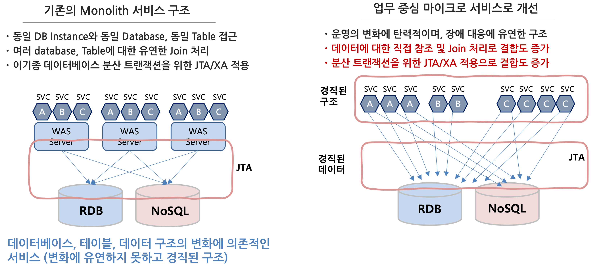

**CNA 분산 데이터 구성 가이드**
==


## **Overview**


기존 마이크로서비스 또는 Cloud Native application 구조에서 데이터를 제외하고 단순하게 업무 중심으로 아키텍처 현대화를 거쳤을 때 발생하는 문제점과 이를 해소하기 위해 적용 가능한 아키텍처 패턴을 기술한다.


## **업무 중심의 마이크로서비스 전환 시 문제점**


기존의 업무 중심으로 서비스를 나누게 될 경우 운영 관점에서 탄력성과 일부 내결함성을 확보 할 수 있는 유연한 구조로 전환이 가능하다.

그러나, 개발 및 배포 관점으로 확장하는 경우 데이터 의존성으로 인해 발생한는 실제적인 경직된 구조 문제로 인해 마이크로서비스 또는 Cloud Native Applicaiton 적용을 통한 현대화 요건을 확보하기 어려워 질 수 있다.





그림에서 보면 기존의 Monolith 서비스 구조에서 마이크로서비스 중심, Cloud Native Application 중심으로 전환함으로써 시장의 변화, 기술의 변화, 운영 탄력성, 장애 대응 방식의 변화를 통해 변환에 적극적으로 대응 가능한 구조로 현대화가 가능할 것으로 예상하고 있다.

그러나, 실제 사용하는 데이터베이스는 하나의 통합 DB를 집적 접근하고,처리하고, Join함으로써 데이터의 변화로 인한 관련 서비스의 영향도가 초기 고려했던 상황보다 더욱 심각하게 연결되어 있으므로 해서 개발, 배포, 운영의 유연성을 확보하기가 어려워 진다.

특히 초기에 테이블 단위로 해서 나누어 사용하는것으로 상화간에 개발 정책으로 정의하더라도 결국 개발 막바지에 다다르거나 또는 지속적인 개선이 되면서 그러한 약속은 퇴색되어 지고 결국 가장 빠르고 쉬운 방법을 선택하게 됨으로써 그렇게 타파하고자 했던 Monolilth Service 구조로 다시 회기 하게 된다.

단지 기존 Thread 단위의 서비스 구조에서 Container 단위의 더 거대해진 Monolith Service 구조로…


```
❈ **고려 사항**

일반적으로 데이터베이스를 분리한다는 의미를 Database Instance를 분리하는 것으로 오해하는 경우가 많다. 
하지만 여기서 데이터베이스의 분리는 물리 Instance를 분리한다는 것이 아니라 단일 Instance 내에서 database (Schema)를 분리하는 것을 의미한다.
만약 인스터스를 분리해야 하는 경우에는 다음을 고려해야 한다.

첫째, 단일 데이터베이스 인스턴스를 활용 시 성능적 이슈가 발생할 가능성이 높은가? 
예를들어 접속하는 connection 수가 급속도로 증가하게 됨으로 해서 이를 수용하기 어려운 경우에는 인스턴스를 분리해야 할 필요가 있다. 
간혹 이를 해소하기 위해 Connection Pool을 중앙에서 통제하는 형태로 고려하기도 하지만, 이것은  가장 심각한 장애 포인트를 야기할 수 있고, 
개발의 자유도를 떨어뜨릴 수 있으므로 주의해야 한다.

둘째, 이기종의 데이터베이스를 활용할 필요가 있는가?
기존에는 RDB에 모든 데이터를 저장하고 관리하는 체계였지만 서비스가 현대화 되면서 다양한 유형으로 데이터를 저장하고 관리할 필요성이 증대되었다.
기존의 최종 상태 정보를 완전한 트랜잭션과 일관성을 보장하기 위해 RDB를 이용하며, 대량의 데이터 또는 히스토리 데이터를 관리 저장하기 위해서는 
다양 유형의 NoSQL DB를 활용해야 하는 경우가 많아지고 있다. 이러한 요건이 있을 경우 DB Instance의 분리가 필요하다.

셋째, 물리적으로 분리되어 있는가?
기존에는 내부 네트워크내에 데이터베이스와 서비스가 공존하게 됨으로써 성능적인 이슈, 보안 이슈 등의 문제를 고려할 필요가 없었다. 
그러나 최근에는 Hybrid Cloud, Multi-Cloud 환경으로 인해 기존의 분산 환경 범위를 크게 확대하고 있다. 
그러므로 이러한 것을 고려해서 데이터 인스턴스의 분리를 고려할 수 있다.
```


## **진정한 마이크로서비스 아키텍처로 전환**


이러한 문제들을 해소하기 위해서 우리는 과감하게 데이터의 분리를 진행하게 된다. 그러나, 그 모험의 시작은 다음과 같은 문제로 다시 직면하게 된다.


데이터의 분리는 단일 클러스터 내에서 단순히 데이터 몇개를 복제해서 중복 관리되거나 이기종 데이터베이스를 활용하여 데이터를 복제하는 문제가 아닌 그들간의 변경 흐름에 대해 트랜잭션을 보장하면서 일관성을 보장할 수 있는 문제로 확대된다.

이는 곳 Hybrid Cloud 또는 동일 또는 다른 CSP로 구성된 환경에서 “분산 환경에서의 트랜잭션 보장”, “반정규화 환경에서의 일관성 보장”, “분산 데이터 구조에서의 Joins 처리” 등을 지원할 수 있어야 한다.


## **해결 방안**

이 3가지 문제를 해소하기 위해서는 Outbox, CQRS & SAGA 등의 분산 환경에서 트랜잭션과 일관성을 보장하기 위한 메커니즘이 필요하다.

이에 대해 상세 설명은 다음을 참조하면 된다. 

[link Saga 개발 가이드](./docs/SAGA.README.md)
- [link Saga Orchestrator 참조 코드](./saga-orchestrator)
- [link Saga Participant 참조 코드](./saga-consumer)

[link CQRS 개발 가이드](./docs/CQRS.README.md)
- [link CQRS Consumer Streams 참조 코드](./cqrs-consumer-streams)
 


