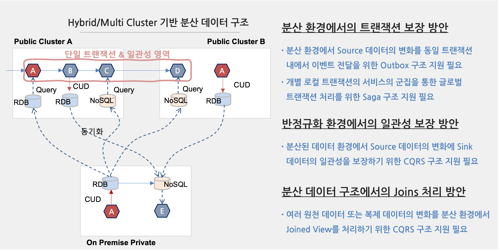

**CNA 분산 데이터 구성 가이드**
==


## **Overview**


k8s 기반으로 현행 시스템을 Cloud Native Application (or Micro-service, mini-service)로 전환하는 시 일반적으로 Application 중심으로 크기 조정을 통해 유연성을 높이고 결합도를 낮추는 작업을 수행한다. 그러나, 데이터에 대한 리 아키텍처를 고려하지 않은 상태에서 단순하게 업무 로직 중심으로만 전환 시 발생 할 수 있는 문제와 이를 해소하기 위한 방안에 대해 기술하고자 한다.

## **Business Instance-based Pseudo Micro-Service**


우리가 일반적으로 알고 있는 기존의 Monolith 구조에서 Micro or Mini Service 구조로 전환하게 되는 경우 업무 인스턴스를 운영하는 관점에서 서비스 대응 시 탄력성과 내결함성을 확보 할 수 있다.
그러나, 기술의 변화, 고객 요구 사항의 변화, 시장 트렌드의 변화에 선제적 또는 즉시 대응하고자 하는 경우 데이터 구조의 변화로 인해 초기 기대했던 무중단 수시배포, 새로운 기술을 즉시 도입, 인스턴스의 탄력성, 무중단 서비스 등의 예상했던 장점들을 기대하는 것이 어려워 질 수 있다.
다음 그림은 현재 대부분의 프로젝트에서 업무 중심의 마이크로 서비스 개선 구조에 대한 예이다.


그림에서 보면 기존의 “Monolith 서비스 구조”에서 “업무 중심 마이크로서비스 중심”으로 전환함으로써 시장의 변화, 기술의 변화, 운영 탄력성, 장애 대응 방식의 변화를 통해 변환에 적극적으로 대응 가능한 구조로 대응이 가능할 것으로 기대한다.
그러나, 하나의 통합 DB(물리적 Instance가 아닌 논리적 하나의 DB Schema)내에 테이블들에 직접 접근하고 검색하고, 그룹핑/조인 등을 하게 되면서 데이터 중심의 결합도가 높아지고 이로 인한 개발, 배포, 운영의 유연성을 떨어질 수 밖에 없어진다.
이러한 데이터를 고려하지 않는 구조는 초기에 업무 로직 중심으로 구조화가 잘되어 있다고 하더라도 결국  지속적인 변화로 인해 기존에 Monolith Service가 가지고 있던 기술 부채 문제, 배포 장애, 무중단 서비스 불가 등의 다양한 문제에서 벗어 날 수 없게 될 가능성이 높아지게 된다.
단지 기존 Thread 단위의 서비스 구조에서 Container 단위의 더 거대해진 Monolith Service 구조로…


```
❈ 고려 사항

일반적으로 데이터베이스를 분리한다는 의미를 Database Instance를 분리하는 것으로 오해하는 경우가 많다. 
하지만 여기서 데이터베이스의 분리는 물리 Instance를 분리한다는 것이 아니라 단일 Instance 내에서 database (Schema)를 
분리하는 것을 의미한다. 만약 인스터스를 분리해야 하는 경우라면 다음을 고려해서 결정하는 것을 권고한다

첫째, 단일 데이터베이스 인스턴스를 활용 시 성능적 이슈가 발생할 가능성이 높은가? 
예를들어 접속하는 connection 수가 급속도로 증가하게 됨으로 해서 이를 지원하기 어려운 경우에는 인스턴스를 분리해야 할 필요가 있다. 
간혹 이를 해소하기 위해 Connection Pool을 중앙에서 통제하는 형태로 고려하기도 하지만, 
이것은  가장 심각한 장애 포인트를 야기할 수 있고, 개발의 자유도를 떨어뜨릴 수 있으므로 주의해서 적용이 필요하다. 
만약 필요한 서비스 중심으로 데이터를 Encapsulation 할 것을 고려할 필요가 있다.

둘째, 이기종의 데이터베이스를 활용할 필요가 있는가?
기존에는 RDB에 모든 데이터를 저장하고 관리하는 체계였지만 
서비스가 현대화 되면서 다양한 유형으로 데이터를 저장하고 관리할 필요성이 증대되었다.
기존의 최종 상태 정보를 완전한 트랜잭션과 일관성을 보장하기 위해 RDB를 이용하며, 
대량의 데이터 또는 히스토리 데이터를 관리 저장하기 위해서는 다양 유형의 NoSQL DB를 활용해야 하는 경우가 많아지고 있다. 
이러한 요건이 있을 경우 DB Instance의 분리가 필요하다.

셋째, 물리적으로 분리되어 있는가?
기존에는 내부 네트워크내에 데이터베이스와 서비스가 공존하게 됨으로써 성능적인 이슈, 보안 이슈 등의 문제를 고려할 필요가 없었다. 
그러나 최근에는 Hybrid Cloud, Multi-Cloud 환경으로 인해 기존의 분산 환경 범위를 크게 확대하고 있다. 
그러므로 이러한 것을 고려해서 데이터 인스턴스의 분리를 고려할 수 있다.
```


## **Genuine Micro-Service Architecture로 전환**


프로젝트를 수행하는 아키텍트나 개발자는 이러한 문제들을 프로젝트 중간 또는 운영 단계에서 마주하게 되면서 이를 해결하기 위해 데이터 분리를 고려하게 된다. 하지만, 곧 그 모험의 시작은 다음과 같은 문제로 인해 좌초하게 된다.




데이터의 분리는 단일 클러스터 내에서 단순히 데이터 몇개를 복제해서 중복 관리되거나 이기종 데이터베이스를 활용하여 데이터를 복제하는 문제가 아닌 그들간의 데이터 흐름에 대해 트랜잭션을 깨지않으면서 일관성을 보장할 수 있는 문제로 확대된다.
이는 곳 Hybrid Cloud 또는 CSP 간에 구성된 Federation 환경에서 “분산되어 있는 데이터의 트랜잭션 보장”, “반정규화 환경에서의 일관성 보장”, “분산 데이터 구조에서의 Joins 처리” 등을 지원할 수 있어야 한다.


## **Outbox Pattern 기반의 분산 데이터 관리 방안**

“분산되어 있는 데이터의 트랜잭션 보장”, “반정규화 환경에서의 일관성 보장”, “분산 데이터 구조에서의 Joins 처리” 등 현존하는 3가지 문제를 해소하기 위해서 다양한 유형의 해결 솔루션을 제공 할 수 있지만 여기에서는 Kafka/Kafka Connect, Outbox Pattern을 적용하여 분산 환경에서 트랜잭션(SAGA) 및 일관성(CQRS)을 보장하기 위한 방안을 제시하고 한다.
이에 대해 상세 설명은 다음을 참조하면 된다.


[분산 트랜잭션 보장을 위한 Saga 개발 가이드](./docs/SAGA.README.md)
- [Saga Orchestrator 샘플 코드](./saga-orchestrator)
- [Saga Participant(Customer/Payment) 샘플 코드](./saga-consumer)
- [Saga Participant(Ticket) 샘플 코드](./saga-ticket-consumer)
- [Saga Kafka Connector 설정 코드](./connectors/saga-outbox-connector)

[분산/중복 데이터에 대한 일관성 및 Joins 처리를 위한 CQRS 개발 가이드](./docs/CQRS.README.md)
- [CQRS Consumer Streams 샘플 코드](./cqrs-consumer-streams)
- [CQRS Kafka Connector 설정 코드](./connectors/cqrs-cdc-connector)
 


