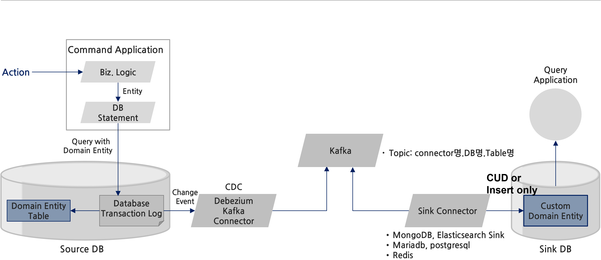
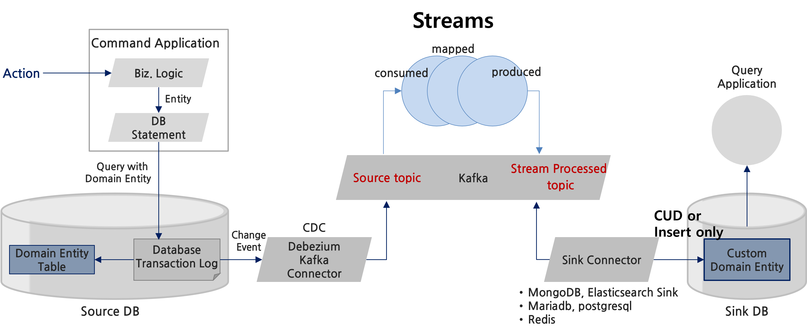
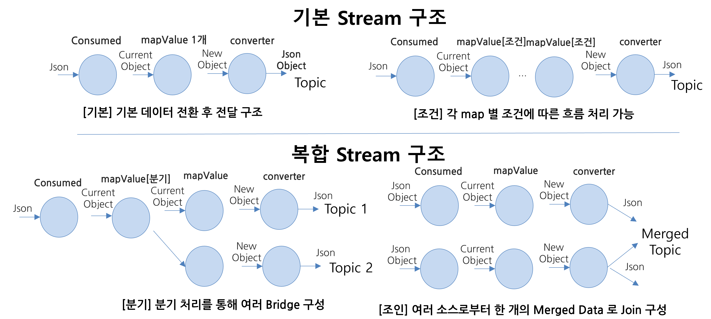
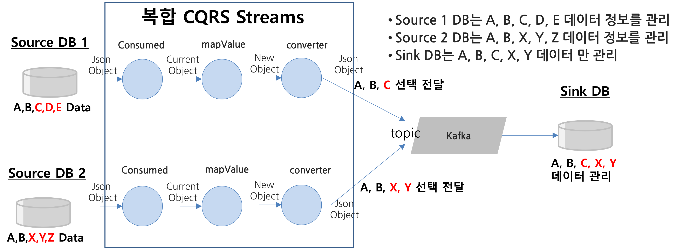

**CQRS 개발 가이드**
==


## **Overview**


본 가이드는 CNAData 프레임워크 기반으로 Cqrs Consumer Stream Service를 개발하기 위한 가이드를 제공한다

본 가이드는 PurchaseOrder Service에서 사용하고 있는 PurchaseOrder Entity (Table) 의 Row 생성 및 업데이트, 삭제 상태 변화를 실시간으로 수집하여 Sink Service의 DB에 동기화하는 방식에 대한 설명한다.

여기서는 Kafka Connect를 활용하는 경우 CDC 기반 구성 시 Source DB Table의 변화를 Sink DB Table에 단순히 동기화하는 구조에 추가적으로 Sink DB Table에 대해 다양한 View를 구성하는 것에 대해 설명한다.


## **CQRS 구성 아키텍처 정의**


CQRS를 구성하기 위한 방식은 2가지로 나눠서 볼 수 있다.

### **CDC-Based CQRS**





이 방식은 Source DB에서의 Domain Entity 변화를 인지해서 Sink DB에 동일하게 상태 변화를 복제하는 방식이다.

이 방식은 Source DB Table 구조를 Sink DB Table에 이름을 변경하거나 Field를 삭제 및 추가할 수 있는 수준의 동기화를 제공하고 있다.

이 방식은 장점은 Application에서는 특별한 개발 없다.

대신 이를 이용하기 위해서는 Source DB 변화를 check하고 변경 Event를 Topic으로 발생시키는 Source Kafka connect 설정과 발생된 Topic을 감시하고 변경 사항 발생 시 Sink DB로 topic을 DB를 위한 CRD를 수행하는 Sink Kafka Connect Configuration을 다음과 같이 설정하면 된다.

**Source Kafka Connector Configuration for MariaDB**


```json
{
    "name": "mariadb-json-source-cqrs",
    "config": {
        "connector.class": "io.debezium.connector.mysql.MySqlConnector",
        "database.hostname": "a77af7a1caaaf4d84a206b39779ef098-c3ca47260c19debc.elb.ap-northeast-2.amazonaws.com",
        "database.user": "admin",
        "database.password": "xxxx",
        "database.history.kafka.bootstrap.servers": "mydev-db-mytest-kafka.mydev-db:9092",
        "database.history.kafka.topic": "cdc-schema.test",
        "event.deserialization.failure.handling.mode": "warn",
        "database.server.name": "mydev-db",
        "database.include.list": "mydev-db",
        "table.include.list": "mydev-db.PurchaseOrder,mydev-db.OrderLine",

        "heartbeat.interval.ms": "0",
        "event.processing.failure.handling.mode": "warn",
        "snapshot.delay.ms": "0",
        "include.schema.changes": "true",
        "inconsistent.schema.handling.mode": "warn",
        "decimal.handling.mode": "string",
        "snapshot.new.tables": "parallel",
        "binlog.buffer.size": "1024",
        "snapshot.fetch.size": "1024",
        "include.query": "false",
        "key.converter": "org.apache.kafka.connect.json.JsonConverter",
        "value.converter": "org.apache.kafka.connect.json.JsonConverter",
        "value.converter.schemas.enable": "true",
        "key.converter.schemas.enable": "true",
        "tombstones.on.delete" : "false",
        "transforms": "unwrap,route",
        "transforms.route.type": "org.apache.kafka.connect.transforms.RegexRouter",
        "transforms.route.regex": "([^.]+)\\.([^.]+)\\.([^.]+)",
        "transforms.route.replacement": "MyProject.$3",

        "transforms.unwrap.type" : "io.debezium.transforms.ExtractNewRecordState",
        "transforms.unwrap.drop.tombstones": "false",
        "transforms.unwrap.delete.handling.mode": "rewrite",
        "transforms.unwrap.add.fields.prefix": "",
        "transforms.unwrap.add.fields" : "table:aggregateType,op:operation,source.ts_ms:timestamp",
        "transforms.unwrap.add.headers.prefix": "",
        "transforms.unwrap.add.headers" : "table:aggregateType,op:operation,source.ts_ms:timestamp",
        "transforms.unwrap.table.op.invalid.behavior": "warn"
    }
}
```


<table>
  <tr>
   <td><strong>key</strong>
   </td>
   <td><strong>설명</strong>
   </td>
   <td>
   </td>
  </tr>
  <tr>
   <td>database.hostname
   </td>
   <td>database hostname
   </td>
   <td>
   </td>
  </tr>
  <tr>
   <td>database.user
   </td>
   <td>db id
   </td>
   <td>
   </td>
  </tr>
  <tr>
   <td>database.password
   </td>
   <td>db password
   </td>
   <td>
   </td>
  </tr>
  <tr>
   <td>database.history.kafka.bootstrap.servers
   </td>
   <td>kafka server 접속 정보 
   </td>
   <td>
   </td>
  </tr>
  <tr>
   <td>database.server.name
   </td>
   <td>서버 명 : DB Instance를 구별을 위한 server name
   </td>
   <td>
   </td>
  </tr>
  <tr>
   <td>database.include.list
   </td>
   <td>database 이름 목록  예) “db1, db2”
   </td>
   <td>
   </td>
  </tr>
  <tr>
   <td>table.include.list
   </td>
   <td>default는 {database-name}.OutboxEvent
   </td>
   <td>
   </td>
  </tr>
  <tr>
   <td>transforms.route.replacement
   </td>
   <td>{server-name}.{databasename}.{Aggregate-name} 구조를 CQRS를 위한 형태로 topic Name을 변경한다.
<p>
여기서는 {Project-Name}.{Aggregate-name}
<p>
참고사항: JPA 기반 Domain Entity 생성 시 Table 명을 Aggreagate Name으로 생성되도록 설정 필요 
<p>
이 설정은 “sring.jpa.hibernate.naming” 정책에 설정을 따르면 됨.
<p>
만약 JPA를 미 사용 시 Table Name은 AggregateName과 동일하게 사용할 것을 권고 
   </td>
   <td>
   </td>
  </tr>
</table>


**Sink Kafka Connector Configuration for MariaDB**


```json
{
  "name": "mariadb-json-sink-cqrs",
  "config": {
    "connector.class": "io.confluent.connect.jdbc.JdbcSinkConnector",
    "task.max": "1",
    "connection.url": "jdbc:mariadb://a77af7a1caaaf4d84a206b39779ef098-c3ca47260c19debc.elb.ap-northeast-2.amazonaws.com/test",
    "connection.user": "admin",
    "connection.password": "ywyi1004",
    "auto.create": "true",
    "auto.evolve": "true",
    "key.converter": "org.apache.kafka.connect.json.JsonConverter",
    "value.converter": "org.apache.kafka.connect.json.JsonConverter",
    "key.converter.schemas.enable": "true",
    "value.converter.schemas.enable": "true",
    "pk.mode": "record_key",
    "insert.mode": "upsert", 
    "delete.enabled": "true",
    "topics.regex": "MyProject.(.*)",
    "table.name.format": "${topic}",
    "tombstones.on.delete" : "true",
    "transforms": "unwrap,route,ReplaceField,InsertField",
    "transforms.ReplaceField.type" : "org.apache.kafka.connect.transforms.ReplaceField$Value",
    "transforms.ReplaceField.blacklist" : "__deleted",
    "transforms.unwrap.type": "io.debezium.transforms.ExtractNewRecordState",
    "transforms.unwrap.drop.tombstones": "true",
    "transforms.route.type": "org.apache.kafka.connect.transforms.RegexRouter",
    "transforms.route.regex": "([^.]+)\\.([^.]+)\\.([^.]+)",
    "transforms.route.replacement": "$3",

    "transforms.InsertField.type" : "org.apache.kafka.connect.transforms.InsertField$Value",
    "transforms.InsertField.static.field" : "type",
    "transforms.InsertField.static.value" : "cqrs"
  }
}
```


이 설정을 통해 test database 내에 Source Table과 동일한 Sink Table을 자동 생성, 업데이트를 제공한다.


<table>
  <tr>
   <td><strong>key</strong>
   </td>
   <td><strong>설명</strong>
   </td>
   <td>
   </td>
  </tr>
  <tr>
   <td>connection.url
   </td>
   <td>database 접속 정보/{database name}
   </td>
   <td>
   </td>
  </tr>
  <tr>
   <td>connection.user
   </td>
   <td>db id
   </td>
   <td>
   </td>
  </tr>
  <tr>
   <td>connection.password
   </td>
   <td>db password
   </td>
   <td>
   </td>
  </tr>
  <tr>
   <td>topic.regex
   </td>
   <td>Source Kakfa Connector 설정의 “transforms.route.replacement” 과 동일한 이름을 사용
<p>
{Project-Name}.{Aggregate-Name}
   </td>
   <td>
   </td>
  </tr>
</table>


### **CQRS Customer Stream Service 를 이용한 CQRS**

앞서 언급한 CDC 기반 구조는 단지 데이터를 동기화하는 것에 목표를 두고 있다면, 이 방식은 다음과 같이 Stream 상에서 별도 처리를 개발하여 다양한 View를 구성하도록 지원한다.

(참고, 여기서는 CQRS 구성을 용이하게 적용하기 위해 Kafka Stream 기능을 활용하지 않고, 자체적인 Stream 구조를 적용하였다)





이방식은 앞서 CDC 기능 구조에 Kafka 내부에서 Streams 를 별도로 구성하여 Source Topic ({ProjectName}.{AggregateType}, 예) MyProject.PurchaseOrder)으로 부터 Record를 읽어 들여, 자체적으로 데이터를 Transform, Join, Merging 한 후 그 결과를 Sink Topic({ProjectName}.stream.{AggregateType}, 예) MyProject.stream.PurchaseOrder)으로 producing하는 과정이 추가되어 있다.

**Source Kafka Connector Configuration for MariaDB**

CDC-Based CQRS와 동일하다.

**Sink Kafka Connect Configuration for MariaDB**

CDC-based CQRS 와 동일하게 구성되지만

“topic.regex”: “MyProject.stream.(.*)” 로 name에 “stream”이 추가 된다.


**Schema 를 포함하는 Avro Converter 사용 시 설정**

기본 설정은 Json Convert로 설정되어 있으나, 만약 Avro로 설정 변경하고자 하는 경우 다음과 같이

key와 value converter를 AvroConverter로 변경하고 Schema-registry를 설정해주면 된다.


```json
"key.converter":"io.confluent.connect.avro.AvroConverter",
"value.converter": "io.confluent.connect.avro.AvroConverter",
"key.converter.schema.registry.url": "http://schema-registry-service:8080",
"value.converter.schema.registry.url": "http://schema-registry-service:8080",
```


## **CQRS Stream Service 구성 설정**


CQRS Stream Service는 Kafka Consumer와 Producer를 동시에 수행하고 이 과정을 Stream으로 구성하여 제공한다. (단, 본 CNAData 는 Kafka Stream 을 이용하지 않고 CQRS에 최적화된 Stream 구조를 별도로 제공하고 있다)

### **의존성 주입**

현재까지 검증된 버전은 다음과 같다


```xml
<properties>
  <java.version>11</java.version>
  <spring.cloud-version>Hoxton.SR8</spring.cloud-version>
  <resilience4jVersion>1.7.1</resilience4jVersion>
  <avro.version>1.8.2</avro.version>
  <confluent.version>5.2.0</confluent.version>
</properties>
```


향후 다양한 버전에  대해 검증을 진행 할 예정이다.

Schema Registry를 미사용하는 경우에는 아래와 같이 spring-kafka에 대한 의존성을 주입하면 된다.


```xml
<!-- Apache Kafka -->
<dependency>
  <groupId>org.springframework.kafka</groupId>
  <artifactId>spring-kafka</artifactId>
</dependency>
```


그러나, Schema Registry를 사용해야 하는 경우에는 Avro Serializer & Deserializer를 위해 아래와 같이 추가적인 의존성 주입이 필요하다.


```xml
<!-- Kafka avro -->
<dependency>
  <groupId>org.springframework.cloud</groupId>
  <artifactId>spring-cloud-stream-binder-kafka</artifactId>
</dependency>
<dependency>
  <groupId>org.apache.avro</groupId>
  <artifactId>avro</artifactId>
  <version>${avro.version}</version>
</dependency>
<dependency>
  <groupId>io.confluent</groupId>
  <artifactId>kafka-avro-serializer</artifactId>
  <version>${confluent.version}</version>
</dependency>
<dependency>
  <groupId>io.confluent</groupId>
  <artifactId>kafka-schema-registry-client</artifactId>
  <version>${confluent.version}</version>
</dependency>
```


또한, avro 지원을 위해서는 다음과 같이 build plugin 과 repository를 추가적으로 설정하여야 한다.


```xml
<build>
  <plugins>
     <!-- Avro Build plug-in -->
     <plugin>
        <groupId>org.apache.avro</groupId>
        <artifactId>avro-maven-plugin</artifactId>
        <version>${avro.version}</version>
     </plugin>

  </plugins>
</build>

<!-- Avro Build repository -->
<repositories>
  <repository>
     <id>confluent</id>
     <url>https://packages.confluent.io/maven/</url>
  </repository>
</repositories>
```


### **CNA Data 라이브러리 의존성 주입**

CNA Data Library는 cnadata-producer-lib.jar 와 “cnadata-consumer-lib.jar” 라이브러리를 추가하여야 한다.


```exasol
$ mkdir lib
$ cd lib
$ cp ../../cnadata-producer-lib.jar .
$ cp ../../cnadata-consumer-lib.jar .
$ ls
cnadata-producer-lib.jar  cnadata-consumer-lib.jar
```


그리고 이 디렉토리 내에 있는 cnadata-producer-lib.jar와 cnadata-consumer-lib.jar 파일 위치를 다음과 같이 pom.xml에 의존성 주입한다.


```xml
<dependency>
  <groupId>cnadata</groupId>
  <artifactId>outboxlib</artifactId>
  <version>0.0.1-SNAPSHOT</version>
         <scope>system</scope>
         <systemPath>${basedir}/lib/cnadata-producer-lib.jar</systemPath>
</dependency>
<dependency>
  <groupId>cnadata</groupId>
  <artifactId>outboxcustomlib</artifactId>
  <version>0.0.1-SNAPSHOT</version>
  <scope>system</scope>
  <systemPath>${basedir}/lib/cnadata-consumer-lib.jar</systemPath>
</dependency>
```


### **속성 정의**

기본 Kafka Producer & Consumer 사용  시 Topic Record의 Key와 Value에 대한 Serialize & Deserialize는 Schema를 포함하고 있는 Json 유형을 따른다.


```yaml
spring:
 kafka:
   bootstrap-servers: http://localhost:9092
```


CQRS Stream 서비스는 Source Topic을 기다리기 위해 Consumer Deserializer 설정이 필요하며, Stream 처리 후 그 결과를 Sink Topic으로 전달하기 위해 Producer Serializer 설정이 필요하다.


```yaml
spring:
 kafka:
   consumer:
     key-deserializer: org.apache.kafka.common.serialization.StringDeserializer
     value-deserializer: org.apache.kafka.common.serialization.StringDeserializer
   producer:
     key-serializer: cnadata.consumer.cqrs.serializer.CqrsJsonSerializer
     value-serializer: cnadata.consumer.cqrs.serializer.CqrsJsonSerializer
```


conusmer.key-deserializer와 value-deserializer는 StringDeserializer를 기본으로 설정한다. 만약 위와 같이 설정하지 않는 경우 default로 StringDeserializer를 사용한다.

그러나, producer.key-serializer와 value-serializer는 CqrsJsonSerializer를 별도로 설정하여야 한다.

만약 Schema-Registry와 Avro 기반으로 Serializer & Deserializer를 수행하는 경우 다음과 같이 설정해야 한다.


```yaml
spring:
 profiles:
   active: local
 application:
   name: cqrs-customer-streams
 kafka:
   bootstrap-servers: http://localhost:9092
   consumer:
     key-deserializer: io.confluent.kafka.serializers.KafkaAvroDeserializer
     value-deserializer: io.confluent.kafka.serializers.KafkaAvroDeserializer
     properties.schema.registry.url: http://localhost:9999
   producer:
     key-serializer: cnadata.consumer.cqrs.serializer.CqrsAvroSerializer
     value-serializer: cnadata.consumer.cqrs.serializer.CqrsAvroSerializer
     properties.schema.registry.url: http://localhost:9999
```


참고로 schema registry는 별도 설치가 필요하며  confluence schema registry를 사용하면 된다.

설치를 위한 상세 설명은 “schema registry 설치 가이드”를 참조하면 된다.

### **CQRS Configuration 설정**

Saga Configuration은 다음과 같은 Annotation을 포함하는 Configuration Bean을 생성한다.


```java
@Slf4j
@Configuration
@Import({CqrsStreamsConfiguration.class})
@EntityScan(basePackages = {"cnadata"})
public class CqrsStreamConfig {
```


Configuration 어노테이션 시  @Import 를 이용하여 CqrsStreamsConfiguration.class를 import 해야 하며, Outbox Entity를 로딩하기 위해 별도 EntityScan을 실행한다.

### **CQRS Stream 생성 하기**

CQRS Streams는  Source Kafka Connect로 부터 생성된 Record를 수신하여 stream 처리 후 그 결과를 Sink Topic으로 전달하는 Stream process를 정의한다.


```java
CqrsStreams cqrsStreams = new CqrsStreams()
       .stream(PurchaseOrder.class, "MyProject.PurchaseOrder")
           .consumed(orderConsumed)
           .mapValues(orderMapper)
           .produced("MyProject.stream.MergedData", new OrderMergedConverter())
           .endThen()
       .stream(OrderLine.class, "MyProject.OrderLine")
           .consumed(orderLineConsumed)
           .mapValues(orderLineMapper)
           .produced("MyProject.stream.MergedData", new OrderLineMergedConverter())
       //.reduce("MyProject.stream.MergedData", new MergedSerializer())
       .build();
```


CqrsStreams는 Source Domain Entity가 CUD OutboxEvent 수신, 처리, 발송을 위한 Stream 프로세스를 등록한다.

CqrsStream의 Method 역할을 다음과 같다.


<table>
  <tr>
   <td><strong>method 명</strong>
   </td>
   <td><strong>설명</strong>
   </td>
   <td><strong>참고</strong>
   </td>
  </tr>
  <tr>
   <td>stream
   </td>
   <td>수신되는 레코드 객체와 topic name 정의 
   </td>
   <td>
   </td>
  </tr>
  <tr>
   <td>consumed
   </td>
   <td>Json 유형의 데이터를 수신하여 Entity Class로 변환 처리
   </td>
   <td>
   </td>
  </tr>
  <tr>
   <td>mapValue
   </td>
   <td>Entity Object를 새로운 View를 표현하는 Object로 변환 처리
   </td>
   <td>
   </td>
  </tr>
  <tr>
   <td>produced
   </td>
   <td>Object롤 Json으로 변환 후 Sink Topic으로 메시지 전달
   </td>
   <td>
   </td>
  </tr>
</table>


이 방식으로 Stream 을 구성 시 다음과 같이 구성 가능한다.





### **CQRS Stream Handler 구성하기**

Stream 처리를 위한 consumed & mapValue handler는 Lambda 함수로 구성할 수 있다.


<table>
  <tr>
   <td><strong>method 명</strong>
   </td>
   <td><strong>설명</strong>
   </td>
  </tr>
  <tr>
   <td>consumed
   </td>
   <td><strong><code>Function&lt;JsonObject, StreamData> orderConsumed = sd -> {
   MergedData order = MergedData.getPurchaseOrder(sd);
   return new StreamData(order.getClass(), String.valueOf(order.getPurchaseOrderId()), order);
};</code></strong>
   </td>
  </tr>
  <tr>
   <td>mapValue
   </td>
   <td><strong><code>
   Function&lt;StreamData, StreamData> orderMapper = sd -> {
   StreamData output = new StreamData(MergedData.class, sd.getKey(), sd.getValue());
   return output;
};</code></strong>
   </td>
  </tr>
</table>


### **CQRS Converter 구성하기**

produced()는 다음과 같이 CqrsConverter를 상속받아서 Serializer 처리를 수행해야 한다.

예시 코드는 다음과 같다.


```java
public class OrderMergedConverter extends CqrsConverter {

   @Override
   public ConvertedData convert(String topicName, StreamData data) {

       return new ConvertedData(
               data.getType().getSimpleName(),
               keySerialize(topicName, data.getValue()),
               valueSerialize(topicName, data.getValue()));

   }
```


convert() method는 토픽 이름과 StreamData를 입력으로 받게 되며, ConvertedData를 return하게 된다.

StreamData 구조는 mapValue()를 통해 만들어진 새로운 View Object를 StreamData 구조로 제공한다.


```java
public class StreamData {
   private Class<?> type;
   private String key;
   private Object value;
}
```


* type: View Object Class Type (예, MergedData.class)
* key: MergedData Key Value String
* value: MergedData Instance

ConvertedData 구조는 다음과 같다.


```java
public class ConvertedData {
   private String aggregateType;
   private CqrsProduceData key;
   private CqrsProduceData value;
}
```


* aggregateType : Target View Table Name (예, MergedData)
* key: topic Record Key (key 값에 대해 동일 Partition에 할당 가능, 순서보장)
* value: topic record (Table column value)

key 생성을 위한 방법은 다음과 같다.


```java
private CqrsProduceData keySerialize(String topicName, Object object)
{
   MergedData order = (MergedData) object;
   return super.createElementsForKey(topicName,
           SchemaElement.KeyOf("id",String.valueOf(order.getPurchaseOrderId()), SchemaType.LONG,false)
   );
}
```


super.createElementForKey() method를 통해 CqrsProduceData를 생성한다 .

SchemaElement.KeyOf()는 topic Key의 Schema를 구성하기 위한 Json 구조 (key 와 value)를 생성하는 역할을 수행한다.

위의 예시는 {“type”: “int64”, “field”: “id”, “optional”: false” } field를 가지는 Schema를 생성한다.

이를 통해 생성된 Key Json 구조는 다음과 같다.


```json
{
  "schema": {
    "type": "struct",
    "name": "MyProject.stream.MergedData.Key",
    "optional": false,
    "fields": [
      {
        "type": "int64",
        "field": "purchaseOrderId",
        "optional": false
      }
    ]
  },
  "payload": {
    "purchaseOrderId": 29
  }
}
```


schema 영역과 payload 영역으로 구분되며, schema 영역은 payload를 sink Kafka에서 converting하기 위한 Schema 정보를 담고 있다. payload는 schema에 따른 Value를 담고 있다.

또한 Value에 대한 Topic Record 구성 방식은 다음과 같이 설정할 수 있다.


```java
private CqrsProduceData valueSerialize(String topicName, Object object) {

   /**
    * Object 중 실제 Sink에 전달 후 사용하기 위한 parameter 만을 여기에 등록
    * 예를들어, MergedData에서 Object로 전달 시 Schema의 field에 포함하지 않을 경우 Field는 제외된다.
    */
   return super.createElementsForValue(topicName,
           object,
           SchemaElement.ValueOf("id", SchemaType.LONG, false),
           SchemaElement.ValueOf("customerId", SchemaType.LONG,false),
           SchemaElement.ValueOf("orderDate", SchemaType.STRING, true)
   );
}
```


MergedData 구조는 다음과 같다.


```java
public class MergedData {
   @Id
   private long id;

   private long purchaseOrderId;

   private long customerId;

   private String orderDate;

   private String item;
   private int quantity;
   private BigDecimal totalPrice;
   private String status;
```


Schema 를 구성하는 방식은 key와 동일하게 처리되지만, Value 생성 방식은 입력되 MergedData 객체를 Json String으로 변환하여 Value를 구성하는 것이 차이가 있다.


```java
{
  "schema": {
    "type": "struct",
    "name": "MyProject.stream.MergedData.Value",
    "optional": false,
    "fields": [
      {
        "type": "int64",
        "field": "purchaseOrderId",
        "optional": false
      },
      {
        "type": "int64",
        "field": "customerId",
        "optional": false
      },
      {
        "type": "string",
        "field": "orderDate",
        "optional": true
      }
    ]
  },
  "payload": {
    "purchaseOrderId": 29,
    "customerId": 100,
    "orderDate": "1643057341115039",
    "items": "item",
    "quantity": 10
  }
}
```


Json 구조로 변환 후 이를 Kafka Record로 전달하며 이는 Kafka Sink Connector를 통해 다양한 유형의 DB에 새로운 View Table로 생성된다.

여기서 중요하는 것은 Schema에 포함되어 있지 않는 값이 payload에 포함되어 있는 경우 Sink Connector에서 Skip 된다는 것인데, 여기서는 items 와 quantity는 schema에 포함되어 있지 않으므로 저장되지 않는다.

특히 여러 Source DB로 부터 데이터 변화를 수집하여 Merging 후 새로운 View로 Sink DB로 관리하고자 할 경우 유용하다. 다음은 Mering에 대한 예시 흐름도이다.





Source DB 1과 Source DB2 에서 발생하는 데이터를 Merged Data로 변환하여 새로운 View를 생성하기 위한 구조의 예시이다.


## **Sink DB Data 삭제 정책**


본 CNAData는 Source DB에서 삭제가 발생하더라도 Sink DB의 데이터 (Table, Document etc)를 삭제하지는 않는다. 대신 operation column=”DELETE”로 표시하여 향후 히스토리 관리가 가능하도록 지원한다. 
