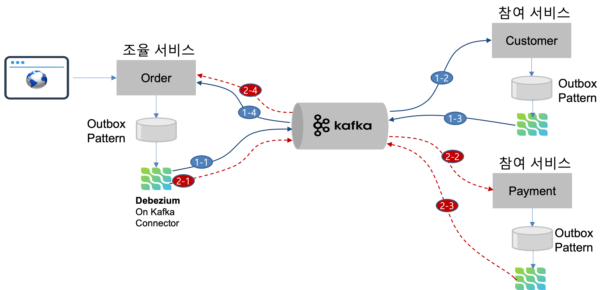

Saga 개발 가이드
==

## **Overview**


본 가이드는 CNAData 프레임워크 기반으로 Saga Orchestrator 및 Saga Participant service를 개발하기 위한 가이드를 제공한다

본 가이드는 주문 서비스 흐름에서 주문을 실행하는 Order Service, 고객 정보를 검색하는 Customer service 그리고 카드 번호를 조회하는 Payment Service를 기반으로 Saga를 구성하고 실행하는 것을 전제로 설명한다.

참고


* Saga Orchestrator: Saga 전체를 Orchestrator하는 조율자 서비스
* Participant: 분산 환경에서 Global Transaction에 참여하는 Saga 참여자 서비스


## **전제 조건**


여기서 기술하는 Saga 구성은 Kafka와 Outbox & CDC 구성을 위한 Debezium based Source Kafka Connector, Sink Kafka Connector를 기반으로 구성되어 있다.




Orchestrator 역할을 수행할 시 Transactional Message인 Outbox Pattern을 적용하게 되는데 이를 위해 DB는 Local Transaction을 보장하는 RDB를 사용해야 한다.

여기서는 MariaDB를 이용해서 Source를 구성하며, 각 Participant는 Kafka와 연동하여 트랜잭션 처리를 수행하게 된다.


## **Saga를 위한 Kafka Connector 설정하기**


Saga Orchestrator가 Saga 처리 요청을 위해 OutboxEvent를 RDB에 insert하면, Saga Connector는 Saga Request Record를 생성하여 {step-name}.outbox.request 토픽으로 전송한다
participant는 자신이 리스닝하고 있는 토픽내 레코드 생성 여부를 확인 후 발생되었을 때 Participant saga 처리 또는 보상 처리 절차에 따라 Saga 처리를 수행하며 그 결과를 자신의 RDB에 OutboxEvent로 Insert를 수행한다.

Saga Json Connector는 OutboxEvent 컬럼 생성 여부를 확인 후 즉시 Saga Event인 Outbox Event record를 생성하여{sagaName_stepName}.RESPONSE.outbox 토픽으로 레코드를 전송한다.

이러한 과정을 통해 전체 Saga 처리가 수행되게 되는데 이를 처리 할 수 있도록 하기 위해서는 각 request 와 response 처리를 위한 Saga Json Connector를 Kafka Connect에 생성할 수 있어야 한다.


```
❊ 고려사항

Saga Connector는 database 별로 한개씩 생성해야 한다. 예를들어, mydev-db database와 test database 2개를 사용하는 경우 각 database에는 OutboxEvent Table이 각 한개씩 생성되며, 이를 모니터링하고 트리거링 하는 Json Connector를 각각 생성/등록하여야 한다.
```


### **Saga Kafka Connector 설정  (OutboxEvent 처리)**

**Schema 를 포함하는 Json Converter 사용 시 설정**


```json
{
    "name": "mariadb-json-request-saga",
    "config": {
        "connector.class": "io.debezium.connector.mysql.MySqlConnector",
        "database.hostname": "a77af7a1caaaf4d84a206b39779ef098-c3ca47260c19debc.elb.ap-northeast-2.amazonaws.com",
        "database.user": "admin",
        "database.password": "xxxx",
        "database.server.id": "6275",
        "database.history.kafka.bootstrap.servers": "mydev-db-mytest-kafka.mydev-db:9092",
        "database.history.kafka.topic": "saga-request.history",
        "event.deserialization.failure.handling.mode": "warn",
        "database.server.name": "mydev-db",
        "database.include.list": "mydev-db",
        "table.include.list": "mydev-db.OutboxEvent",

        "heartbeat.interval.ms": "0",
        "event.processing.failure.handling.mode": "warn",
        "snapshot.delay.ms": "0",
        "include.schema.changes": "true",
        "inconsistent.schema.handling.mode": "warn",
        "decimal.handling.mode": "string",
        "snapshot.new.tables": "parallel",
        "binlog.buffer.size": "1024",
        "snapshot.fetch.size": "1024",
        "include.query": "false",
        "value.converter": "io.debezium.converters.ByteBufferConverter",
        "value.converter.delegate.converter.type": "org.apache.kafka.connect.json.JsonConverter",
        "value.converter.delegate.converter.type.schemas.enable": "false",
        "tombstones.on.delete" : "false",
        "transforms": "outbox",
        "transforms.outbox.type" : "io.debezium.transforms.outbox.EventRouter",
        "transforms.outbox.table.expand.json.payload": "true",
        "transforms.outbox.route.by.field": "topicPrefix",
        "transforms.outbox.route.topic.replacement" : "${routedByValue}.outbox",
        "transforms.outbox.table.op.invalid.behavior": "warn",
        "transforms.outbox.table.field.event.id" : "id",
        "transforms.outbox.table.field.event.key" : "aggregateId",
        "transforms.outbox.table.field.event.payload" : "payload",
        "transforms.outbox.table.fields.additional.placement" : "id:envelope,createdAt:envelope,sentAt:envelope,aggregateType:envelope,aggregateId:envelope,eventType:envelope,payloadType:envelope,status:envelope,version:envelope,topicPrefix:envelope"
    }
}
```

본 설정에서 대부분은 변경할 필요가 없으며, 이 중 다음 설정은 변경하여 사용하면 된다.


<table>
  <tr>
   <td><strong>key</strong>
   </td>
   <td><strong>설명</strong>
   </td>
   <td><strong>비고</strong>
   </td>
  </tr>
  <tr>
   <td>database.hostname
   </td>
   <td>database hostname
   </td>
   <td>
   </td>
  </tr>
  <tr>
   <td>database.user
   </td>
   <td>db id
   </td>
   <td>
   </td>
  </tr>
  <tr>
   <td>database.password
   </td>
   <td>db password
   </td>
   <td>
   </td>
  </tr>
  <tr>
   <td>database.history.kafka.bootstrap.servers
   </td>
   <td>kafka server 접속 정보 
   </td>
   <td>
   </td>
  </tr>
  <tr>
   <td>database.server.name
   </td>
   <td>서버 명 : DB Instance를 구별을 위한 server name
   </td>
   <td>
   </td>
  </tr>
  <tr>
   <td>database.include.list
   </td>
   <td>database 이름 목록  예) “db1, db2”
   </td>
   <td>
   </td>
  </tr>
  <tr>
   <td>table.include.list
   </td>
   <td>default는 {database-name}.OutboxEvent
   </td>
   <td>
   </td>
  </tr>
</table>


```
❊ **주의 사항**

기본적으로 database.include.list는 database 를 한개 이상 등록할 수 있다. 이렇게 함으로써 하나의 Kafka Connector를 등록하여 여러 database의 변화를 수집하고 처리할 수 있다. 그러나, database를 삭제 및 재 등록하는 경우 기존 데이터(Offset 등)가 완전하게 삭제 될 수 없게 되면서 비정상적으로 동작할 가능성이 있다. 또한 Order Issue를 해소하기 위해 기본 Task를 1로 설정하게 되는데 이로 인해 여러 Database를 등록하는 경우 성능적인 문제도 야기 될 수있다. 그러므로 작성 시  database 당  한개의 Kafka Connector를 등록 관리하는 것을 권고 한다. 또한 신규 생성 시 동일 이름을 사용하여 재 생성하지 말고 Random HashCode를 붙여서 관리하는 것을 권고한다.
```


**Schema 를 포함하는 Avro Converter 사용 시 설정**


```json
"key.converter":"io.confluent.connect.avro.AvroConverter",
"value.converter": "io.confluent.connect.avro.AvroConverter",
"key.converter.schema.registry.url": "http://schema-registry-service:8080",
"value.converter.schema.registry.url": "http://schema-registry-service:8080",
```

본 설정에서 대부분은 Json과 동일하며, “key.converter”, “value.converter”는 AvronConverter로 변경 하며, “key.converter.schema.registry.url”과 “value.converter.schema.registry.url”는 schema-registry 접속정보를 추가하면 된다.


## **Saga Orchestrator 구성 설정**


PurchaseOrder 서비스는 주문 요청을 받아서 Saga Orchestrator 역할을 수행하게 되는데 이것을 수행하기 위해서는 Saga Orchestrator를 위한 의존성 주입 및 Application properties 설정을 수행해야 한다.

### **의존성 주입**

현재까지 검증된 버전은 다음과 같다


```xml
<properties>
    <java.version>11</java.version>
    <spring.cloud-version>2021.0.0</spring.cloud-version>
    <avro.version>1.8.2</avro.version>
    <confluent.version>5.2.0</confluent.version>
</properties>
```


향후 다양한 버전에  대해 검증을 진행 할 예정이다.
Schema Registry를 미사용하는 경우에는 아래와 같이 spring-kafka에 대한 의존성을 주입하면 된다.


```xml
<!-- Apache Kafka -->
<dependency>
  <groupId>org.springframework.kafka</groupId>
  <artifactId>spring-kafka</artifactId>
</dependency>
```


그러나, Schema Registry를 사용해야 하는 경우에는 Avro Serializer & Deserializer를 위해 아래와 같이 추가적인 의존성 주입이 필요하다.


```xml
<!-- Kafka avro -->
<dependency>
  <groupId>org.springframework.cloud</groupId>
  <artifactId>spring-cloud-stream-binder-kafka</artifactId>
</dependency>
<dependency>
  <groupId>org.apache.avro</groupId>
  <artifactId>avro</artifactId>
  <version>${avro.version}</version>
</dependency>
<dependency>
  <groupId>io.confluent</groupId>
  <artifactId>kafka-avro-serializer</artifactId>
  <version>${confluent.version}</version>
</dependency>
<dependency>
  <groupId>io.confluent</groupId>
  <artifactId>kafka-schema-registry-client</artifactId>
  <version>${confluent.version}</version>
</dependency>
```


또한, avro 지원을 위해서는 다음과 같이 build plugin 과 repository를 추가적으로 설정하야 한다.


```xml
<build>
  <plugins>
     <!-- Avro Build plug-in -->
     <plugin>
        <groupId>org.apache.avro</groupId>
        <artifactId>avro-maven-plugin</artifactId>
        <version>${avro.version}</version>
     </plugin>

  </plugins>
</build>

<!-- Avro Build repository -->
<repositories>
  <repository>
     <id>confluent</id>
     <url>https://packages.confluent.io/maven/</url>
  </repository>
</repositories>
```


### **CNA Data 라이브러리 의존성 주입 방법**

CNA Data Library는 자체 개발된 Saga 전용 라이브러리이며 이에 대한 의존성 주입은 다음과 같이 수행한다.


```exasol
$ mkdir lib
$ cd lib
$ cp ../../cnadata-producer-lib.jar .
$ ls
cnadata-producer-lib.jar 
```


실행 환경 내에 lib dirctory를 생성한 후 cnadata-producer-lib.jar 파일을 복사한다.

(참고, 이 jar 파일은 Saga 처리를 위한 필요 패키지가 포함된 라이브러리이며, Saga 사용 시 필요적으로 의존성을 주입해야 한다. )

그리고 이 디렉토리 내에 있는 cnadata-producer-lib.jar 파일 위치를 다음과 같이 pom.xml에 의존성 주입한다.


```xml
<dependency>
  <groupId>cnadata</groupId>
  <artifactId>outboxlib</artifactId>
  <version>0.0.1-SNAPSHOT</version>
  <scope>system</scope>
  <systemPath>${basedir}/lib/cnadata-producer-lib.jar</systemPath>
</dependency>
```


### **속성 정의**


1. **기본 속성**

기본 Kafka Producer & Consumer 사용  시 Topic Record의 Key와 Value에 대한 Serialize & Deserialize는 Schema를 포함하고 있는 Json 유형을 따른다.


```yaml
spring:
 kafka:
   bootstrap-servers: http://localhost:9092
```


spring.kafka.bootstrap-servers 설정 후 별도 spring.kafka.producer, consumer를 설정할 필요가 없다. (특히 cnadata library에서 saga 구현은 kafka 에 직접 topic을 생성하는 것이 아니라 kafka connector가 대신 topic을 생성하도록 하기 때문에 producer 설정은 필요없음)

일반적으로 Record 내 Schema를 포함하고 있는 경우로 Schema Registry를 필요로 하지 않지만, Schema Registry를 사용하는 경우에는 다음과 같인 consumer의 key-deserializer와 value-deserializer를 avro 타입으로 설정해야 하며 schema-registry url을 설정해야 한다.


```yaml
spring:
 kafka:
   bootstrap-servers: http://localhost:9092
   consumer:
     key-deserializer: io.confluent.kafka.serializers.KafkaAvroDeserializer
     value-deserializer: io.confluent.kafka.serializers.KafkaAvroDeserializer
     properties.schema.registry.url: http://localhost:9999
```


참고로 schema registry는 별도 설치가 필요하며  confluence schema registry를 사용하면 된다.

설치를 위한 상세 설명은 “schema registry 설치 가이드”를 참조하면 된다.


2. **기본 속성**

data base 생성 시 naming rule은 outbox_event 같은 기본 naming rule이 아닌 Java 객체 이름과 동일한 형태 즉 OutboxEvent 같은 DB Table/Column Naming Rule을 적용하여 사용할 수 있도록 구성이 필요하다.

이를 위해 다음과 같은 설정을 사용한다.


```yaml
spring:
 jpa:
   hibernate:
     naming:
       implicit-strategy: org.hibernate.boot.model.naming.ImplicitNamingStrategyLegacyJpaImpl
       physical-strategy: org.hibernate.boot.model.naming.PhysicalNamingStrategyStandardImpl
```


### **Saga 필수 데이터**


1. **SagaState Entity**


SagaState는 Saga 진행 상태를 추적하고 모니터링하기 위한 데이터이며, 데이터 구조는 다음과 같다.


```java
public class SagaState {
   @Id
   //@GeneratedValue (strategy = GenerationType.IDENTITY)
   /*
     Unique identifier of a given Saga instance,
     representing the creation of one particular purchase order
     UUID Sting type
    */
   private String id;

   @Version
   private long version;
   @NonNull
   private String payloadType;
   @NonNull
   /*
     A nominal type of a Saga,
     e.g., "order-placement"
     useful to tell apart different kinds of Sagas supported by one system
    */
   private String type;

   // Json String
   @Lob
   @NonNull
   private String payload;

   /*
     The step at which the Saga currently is,
     e.g., "credit-approval" or "payment"
    */
   @NonNull
   private String currentStep;

   /*
     A stringified JSON structure describing the status of the individual steps,
     e.g., "{\"credit-approval\":\"SUCCEEDED\",\"payment\":\"STARTED\"}"
    */
   @NonNull
   private String stepStatus;

   /**
    * Saga 처리 동안 임시로 데이터 저장을 위한 Cached 영역
    */
   private String cachedType;

   @Lob
   private String cachedData;

   /**
    * array Json Object
    * {step-name, step-status, return-code, reason}
    */
   @Lob
   @NonNull
   private String sagaStateDetailed;

   /*
       The current status of the Saga;
       one of STARTED, SUCCEEDED, ABORTING, or ABORTED
   */
   @Enumerated(EnumType.STRING)
   private SagaStateStatus sagaStateStatus;


   @Convert(converter=ObjectAttributeConverter.class)
   private Object objectId;

   private Instant createdAt;
   private Instant updatedAt;

}
```


SagaState는 Framework 내부적으로 사용되며, 현재 진행 상태 추적 및 실패 시 실패 현황을 모니터링 하기 위해 사용된다.

이 정보는 자동으로 실시간으로 수집되어 Elastic Search 또는 MongoDB에 저장 관리 된다.


2. **OutboxEvent Entity**

```java
public class OutboxEvent {
@Id
//@GeneratedValue (strategy = GenerationType.IDENTITY)
@Column(name = "id")
private String id;

@NonNull
private String aggregateId;

@NonNull
private String eventType;

@NonNull
private String aggregateType;

@NonNull
private String payloadType;

@Lob
@NonNull
private String payload;

@NonNull
private String status;

@NonNull
private String topicPrefix;

@Version
private long version;
private String createdAt;
private String sentAt;
}
```


3. **Orchestrator Service Entity: PurchaseOrder**

```java
public class PurchaseOrder {

   @Id
   private long id;

   ...

   // Order의 Saga 실행 상황을 업데이트 (Saga 시작 시 STARTED, 종료 시 COMPLETED or ABORTED로 상태 업데이트
   // saga에 들어가는 DomainEntity는 반드시 @Id와 @SagaStatus를 표시하여 한다.
   @SagaStatus
   private String sagaStatus;
```


PurchaseOrder 서비스는 Saga Orchestrator를 수행하는 서비스 domain Entity인데 분산 Transaction 상에서 Isolation 보장을 위해 @Id 와 @SagaStatus annotation을 필수적으로 적용하여야 한다.

Saga Framework 내부에서는 @Id를 통해 Saga Orchestrator 검색하고, @SagaStatus를 통해 Saga 진행 상태를 표시함으로써 Saga 가 완료되지 않은 시점에 다른 Saga가 들어와서 duty read, lost update (트랜잭션 isolation 이슈)를 방지하도록 한다.

### **Saga Configuration 설정**

Saga Configuration은 다음과 같은 Annotation을 포함하는 Configuration Bean을 생성한다.


```java
@Data
@Slf4j
@Configuration
@Import({SagaOrchestratorConfiguration.class})
@EntityScan(basePackages = {"cnadata.bff","cnadata.outbox"})
public class OrderSagaConfiguration {
```


Configuration 어노테이션 시  @Import 를 이용하여 SagaOrchestratorConfiguration.class를 import 해야 하며, SagaState 와 Outbox Entity를 로딩하기 위해 별도 EntityScan을 통해 “cnadata.bff”와 “cnadata.outbox” package를 스캔을 수행한다.

또한 Sag Orchestrator와 Participant 간 Outbox Pattern 기반 비동기 통신을 수행하기 위해 SagaEventPublisher와 OutboxEventListener Bean을 다음과 같이 생성한다.


```java
@Bean
public OutboxEventListener listener() {
   return new OutboxEventListener();
}

@Bean
public SagaEventPublisher  sagaEventPublisher() {
   return new SagaEventPublisher();
}
```


### **Saga Orchestrator Process 생성 하기 **

Saga Orchestrator는 Global Transaction에 참여하는 Participant와 Orchestrator 간 흐름을 통해 정상적인 step 그리고 비정상 처리로 인하 보상 Step 처리를 프로세스로 정의하기 위해 다음과 같이 설정하고 이를 SagaManager로 등록해야 한다.


```java
SagaOrchestrator approvalSaga = new SagaOrchestrator("order-placement")
       .step("customer")
           //1.1. customer participant로 order를 payload에 담아서 요청 처리
           .invokeParticipant(req -> {
               req.getSagaCached(PurchaseOrder.class), req.getPreStepResult());
               return StepMessage.send();
           })
           .onParticipant(rsp -> {
               // Saga Aggregate 정보를 읽어온다.
               PurchaseOrder order = rsp.getSagaAggregate(PurchaseOrder.class);
               // Step 에 대한 응답으로 받은 Customer를 읽어온다.
               Customer customer =     
                     rsp.getStepResult().getParticipant(Customer.class);
               //order 객체에 CreditCardNo를 설정한다.
               order.setCreditCardNo(customer.getCreditCardNo());
               // 변경된 Order 정볼를 Saga Flow에 Caching 수행
               rsp.setSagaCached(order, PurchaseOrder.class);
           })
           // ticket Failed or Compensate 시 보상 처리 실행
           // 기본적으로 SagaAggregate 를 payload에 담아서 전달
           .withCompensate(req -> StepMessage.send())
           .end()
       .step("ticket")
           //1.1. ticket 처리 요청
           .invokeParticipant(req -> StepMessage.send())
           //1.2 ticket saga 처리 결과 수신 후 ticket 정보를 SagaState의 Payload에 저장
           .onParticipant(rsp -> {
               // 앞의 Step에서 Caching한 Order 를 읽어온다.
               PurchaseOrder order = rsp.getSagaCached(PurchaseOrder.class);
               Ticket ticket = rsp.getStepResult().getParticipant(Ticket.class);
               order.setTicketNumber(ticket.getTicketNumber());
               rsp.setSagaCached(order, PurchaseOrder.class);
           })
           //2.1 Ticket 취소 처리 요청
           .withCompensate(req -> StepMessage.send())
           .end()
       .step("payment")
           //1.1. 결제 처리 요청
           .invokeParticipant(req-> {
               PurchaseOrder order = req.getSagaCached(PurchaseOrder.class);

               return StepMessage.replaceAndSend(order, PurchaseOrder.class);
           })
           //1.2. 결제 처리 결과 응답 시 결제 결과를 SagaState에 저장
           .onParticipant(rsp -> {
               PurchaseOrder order = rsp.getSagaCached(PurchaseOrder.class);
               StepResponse response = rsp.getPreStepResult();
               Payment payment = response.getParticipant(Payment.class);
               order.setCreditCardNo(payment.getCreditCardNo());

               rsp.setSagaCached(order, PurchaseOrder.class);

           })
           .end()
       .successSaga(detailed -> {
           PurchaseOrder sagaOrder = 
                detailed.getSagaCached(PurchaseOrder.class);
           PurchaseOrder order = 
                entityManager.find(PurchaseOrder.class, sagaOrder.getId());
           order.setCreditCardNo(sagaOrder.getCreditCardNo());
           order.setTicketNumber(sagaOrder.getTicketNumber());
           entityManager.persist(order);

           log.info("Saga Process Status -- Customer Detailed: {} ",  
                  detailed.getStepDetailed("customer"));
           log.info("Saga Process Status -- Ticket Detailed: {} ", 
                  detailed.getStepDetailed("ticket"));
           log.info("Saga Process Status -- Payment Detailed: {} ", 
                  detailed.getStepDetailed("payment"));
           log.info("Saga Process Status -- Cached Data: {} ", 
                  detailed.getSagaCached(PurchaseOrder.class));
           log.info("Saga Process Status -- Saga Aggregate: {} ", 
                  detailed.getSagaAggregate(PurchaseOrder.class));

           return order;
       })
       .failedSaga(state-> {
           PurchaseOrder order = state.getSagaAggregate(PurchaseOrder.class);
           order = entityManager.find(PurchaseOrder.class, order.getId());
           entityManager.remove(order);

           return order;
       })
       .build();

manager.putSagaOrchestrator(approvalSaga);
```


SagaManager Bean은 Saga Orchestrator와 개별 step을 등록하고 관리하는 역할을 수행한다.

SagaOrchestrator는 하나의 Saga Process를 생성하며, 생성된 Saga Orchestrator는 manager의 pushSagaOrchestrator()를 통해 등록한다. 등록 시 하나의 Saga가 생성된다.

Saga Orchestrator의 Method 역할을 다음과 같다.


<table>
  <tr>
   <td><strong>method 명</strong>
   </td>
   <td><strong>설명</strong>
   </td>
   <td><strong>필수</strong>
   </td>
  </tr>
  <tr>
   <td>step
   </td>
   <td>Saga는 한 개 이상의 Step으로 구성되며, 각 Step은 단일 Local Transaction으로 동작한다.
   </td>
   <td>O
   </td>
  </tr>
  <tr>
   <td>invokeParticipant
   </td>
   <td>step 참여하는 참여 서비스를 호출하기 위한 StepMessage 생성하는 Lambda 함수 를 등록
<p>
Function&lt;SagaMessage, StepMessage>로 람다 함수 구성
   </td>
   <td>O
   </td>
  </tr>
  <tr>
   <td>onParticipant
   </td>
   <td>invokeParticipant() 호출에 대한 응답 수신 시 호출되는 Listener를 등록한다. 
<p>
Consumer&lt;SagaMessage> 로 람다 함수 구성
   </td>
   <td>
   </td>
  </tr>
  <tr>
   <td>withCompensate
   </td>
   <td>Saga 보상 처리 수행 시 참여 서비스를 호출하기 위한 StepMessage를 생성하며 invokeParticipant Lambda 함수 방식과 동일하다. 
   </td>
   <td>
   </td>
  </tr>
  <tr>
   <td>onCompensate
   </td>
   <td>withCompensate() 호출에 대한 응답 수신 시 호출되는 Listener를 등록한다. 
   </td>
   <td>
   </td>
  </tr>
  <tr>
   <td>retry
   </td>
   <td>응답 실패 시 재처리 횟수. 기본은 재처리 수행하지 않음
<p>
0인 경우 무한 반복 실행
   </td>
   <td>
   </td>
  </tr>
</table>


### **Saga 종료 후처리 함수**

후처리 함수는 모든 Saga Step이 완료된 후 성공 또는 실패 시 호출되는 함수를 등록한다.

함수는 SagaOrchestratorResult Interface 기반의 함수를 생성하면 된다.


```java
public interface SagaOrchestratorResult {
   public abstract Object result(SagaStateDetailed detailed);
}
```


전달되는 input은 Saga 처리 History를 모두 포함하고 있는 SagaStateDetailed Class를 제공하고 이를 활용하여 추가적인 작업을 수행하면된다.


<table>
  <tr>
   <td><strong>method 명</strong>
   </td>
   <td><strong>설명</strong>
   </td>
   <td><strong>필수</strong>
   </td>
  </tr>
  <tr>
   <td>successSaga
   </td>
   <td>모든 Saga Step이 정상적으로 완료될 경우 호출되는 후처리 함수 등록
   </td>
   <td>
   </td>
  </tr>
  <tr>
   <td>failedSaga
   </td>
   <td>Saga 가 정상적으로 처리되지 않고 보상처리되거나 Failed 되는 경우 후 처리를 위한 함수 등록
   </td>
   <td>
   </td>
  </tr>
</table>


**예시)**

Saga는 기본적으로 Saga Entity를 생성한 후 Saga Orchestrator를 실행하게 된다.


```java
PurchaseOrder newOrder = purchaseOrderRepository.save(order);
/* Create Saga가 시작했다는 것을 의미 */

SagaBase saga = sagaManager.begin("order-placement", newOrder);
```


이렇게 실행시 Saga가 정상적으로 처리를 하지 못해서 보상처리 또는 실패 시 기존에 생성되어 있던 newOrder를 삭제해야 하는데 이것은 Saga 프로세스 내에서 실행하기 불가능하다.

그러므로 이러한 경우 아래와 같인 failedSaga()에서 삭제 로직을 실행한다.


```java
.failedSaga(state-> {
   PurchaseOrder order = state.getSagaAggregate(PurchaseOrder.class);
   order = entityManager.find(PurchaseOrder.class, order.getId());
   entityManager.remove(order);

   return order;
})
```


반대로 주문을 취소하는 Saga 인경우, 최종 Saga가 실행 완료된 후 successSaga()에서 Order를 삭제하면 된다.

**Saga Message**

모든 Function Interface의 Input Parameter로 Saga를 위한 Saga Aggregate Object, Step Result, Saga 처리 이력 정보, Saga 처리 중 저장 Cached 등을 포함한다.


```java
public class SagaMessage {
   public <T> T getSagaAggregate(Class<T> cls) ;
   public StepResponse getStepResult();
   public StepResponse getPreStepResult();
   public SagaStateDetailed getSagaDetailed();
   public <T> void setSagaCached(Object payload, Class<T> cls);
   public <T> T getSagaCached(Class<T> cls) ;
   public boolean isEmptyInCached();
}
```


<table>
  <tr>
   <td><strong>method 명</strong>
   </td>
   <td><strong>설명</strong>
   </td>
  </tr>
  <tr>
   <td>getSagaAggregate
   </td>
   <td>Saga Object를 제공한다. 
<p>
예) PurchaseOrder order = req.getSagaAggregate(PurchaseOrder.class)
   </td>
  </tr>
  <tr>
   <td>getStepResult()
   </td>
   <td>onParticipant() / onCompensate 내에서 step  응답 결과를 제공한다
   </td>
  </tr>
  <tr>
   <td>getPreResult()
   </td>
   <td>invokeParticipant or withCompensate 내에서 앞의 Step의 Result를 리턴한다.
   </td>
  </tr>
  <tr>
   <td>getSagaDetailed
   </td>
   <td>Saga Process 에서의 개별 Step에 대한 처리 결과 히스토리를 리턴한다.
   </td>
  </tr>
  <tr>
   <td>setSagaCached()
   </td>
   <td>Saga Process 내에서 사용하기 위한 데이터를 캐칭한다.
   </td>
  </tr>
  <tr>
   <td>getSagaCached()
   </td>
   <td>Saga Process 내에서 저장된 Cache 데이터를 가져온다.
<p>
가져 오는 경우 isEmptyInCached()를 통해 데이터가 저장되어 있는지를 확인해야 한다. 없으면 null을 리턴한다.
   </td>
  </tr>
  <tr>
   <td>isEmptyInCached
   </td>
   <td>Caching된 데이터가 존재하는지 확인한다
   </td>
  </tr>
</table>


**SagaStateDetailed**

Saga 프로세스 전체에 대한 이력 정보를 포함한다.


```java
@Data
public class SagaStateDetailed {
   SagaStepDetailed getSuccessStepDetailed(String stepName);
   SagaStepDetailed getFailedStepDetailed(String stepName);
   SagaStepDetailed getCompensatedStepDetailed(String stepName);
   List<SagaStepDetailed> getStepDetailed(String stepName);
   SagaStepDetailed getLastStepDetailed(String stepName);
}

public class SagaStepDetailed {
   String getStepName();
   String getStepStatus(); // SUCCESS, FAILED, COMPENSATED
   StepResponse getResponse(); 
}

public class StepResponse {
   String getRetCode();
   String getReason();
   T getParticipant(Class<T> cls);
```


<table>
  <tr>
   <td><strong>method 명</strong>
   </td>
   <td><strong>설명</strong>
   </td>
  </tr>
  <tr>
   <td>getSuccessStepDetailed
   </td>
   <td>지정된 Step에 대한 성공 Step 결과를 리턴한다.
   </td>
  </tr>
  <tr>
   <td>getFailedStepDetailed
   </td>
   <td>지정된 Step에 대해 실패 Step 결과를 리턴한다.
   </td>
  </tr>
  <tr>
   <td>getCompensatedStepDetailed
   </td>
   <td>지덩된 Step에 대해 보상 처리 결과를 리턴한다.
   </td>
  </tr>
  <tr>
   <td>getStepDetailed
   </td>
   <td>지정된 Step에 대해 모든 결과(성공, 보상 처리/실패)를 리턴한다
   </td>
  </tr>
  <tr>
   <td>getLastStepDetailed
   </td>
   <td>지정된 Step에 대해 최종 결과를 리턴한다.
   </td>
  </tr>
</table>


**StepMessage**

Invoke Participant()로 개별 step에 메시지 전달을 수행한다. 기본은 Aggregate Object를 payload로 전달하나 개별 step 내에서 payload를 변경하고자 하는 경우 replaceAndSend()를 통해 payload 교체 후 전달하면 된다.


```java
@Data
public class StepMessage {
   static StepMessage replaceAndSend(Object payload, Class<?> cls);
   static StepMessage send();
}
```


<table>
  <tr>
   <td><strong>method 명</strong>
   </td>
   <td><strong>설명</strong>
   </td>
  </tr>
  <tr>
   <td>send
   </td>
   <td>invokeParticipant or withCompensate에서 기본 Saga 정보를 기반으로 Step 요청 메시지를 전달한다
   </td>
  </tr>
  <tr>
   <td>replaceAndSend
   </td>
   <td>Saga Aggregate (예, PurchaseOrder) 객체를 요청 메시지로 전달하는 것이 아닌 별도 객체로 교체해서 전달한다.
<p>
이것은 Participant에서 Local Transaction 처리 시 Participant 간 데이터 전달이 필요한 경우 사용 할 수 있다
   </td>
  </tr>
</table>


## **Participant 서비스 **


Participant는 Saga invokeParticipant 또는 invokeCompensate를 통해 요청 시 처리 수행에 참여하는 서비스를 의미한다.

### **의존성 주입**

Participant 의 의존성은 Saga Orchestrator 방식과 동일하게 설정하면 된다.

**CNA Data 라이브러리 의존성 주입 방법 **

CNA Data Library는 orchestrator를 위한 필수 cnadata-producer-lib.jar 외에 추가적으로 “cnadata-consumer-lib.jar” 라이브러리를 추가할 필요가 있다.


```java
$ mkdir lib
$ cd lib
$ cp ../../cnadata-producer-lib.jar .
$ cp ../../cnadata-consumer-lib.jar .
$ ls
cnadata-producer-lib.jar  cnadata-consumer-lib.jar
```


그리고 이 디렉토리 내에 있는 cnadata-producer-lib.jar와 cnadata-consumer-lib.jar 파일 위치를 다음과 같이 pom.xml에 의존성 주입한다.


```java
<dependency>
  <groupId>cnadata</groupId>
  <artifactId>outboxlib</artifactId>
  <version>0.0.1-SNAPSHOT</version>
         <scope>system</scope>
         <systemPath>${basedir}/lib/cnadata-producer-lib.jar</systemPath>
</dependency>
<dependency>
  <groupId>cnadata</groupId>
  <artifactId>outboxcustomlib</artifactId>
  <version>0.0.1-SNAPSHOT</version>
  <scope>system</scope>
  <systemPath>${basedir}/lib/cnadata-consumer-lib.jar</systemPath>
</dependency>
```


### **속성 정의**

속성은 Saga Orchestrator 방식과 동일하게 설정하면 된다.

**Saga Event 처리를 위한 Configuration 설정**

Saga Participant 수신 처리를 위한 Configuration은 다음과 같은 Annotation을 포함하는 Configuration Bean을 생성한다.


```java
@Slf4j
@Configuration
@Import({SagaConsumerConfiguration.class})
@EntityScan(basePackages = {"cnadata","cnadata.outbox"})
public class SagaReceiveConfig {
```


Saga Orchestrator Configuration 과 동일하며, @Import class는 SagaConsumerConfiguration.class를 주입한다. 이 클래스는 Saga Event를 수신하여 처리를 위한 KafkaListener와 ConsumerFactory를 등록하기 위한 Bean를 생성하는 역할을 수행한다.

또한 Sag Orchestrator와 마찬가지로  Participant 간 Outbox Pattern 기반 비동기 통신을 수행하기 위해 SagaEventPublisher와 OutboxEventListener Bean을 다음과 같이 생성한다.


```java
@Bean
public OutboxEventListener listener() {
   return new OutboxEventListener();
}

@Bean
public SagaEventPublisher  sagaEventPublisher() {
   return new SagaEventPublisher();
}
```


**Saga Step 요청 처리를 위한 Receive 처리 Instance 생성 하기**

Saga Receive Instance는 Orchestrator로 부터의 요청을 처리하기 위한 절차를 설정한다.


```java
SagaParticipants sagaParticipants = new SagaParticipants()
   .add("order-placement") // Saga Name 등록
   .participant("credit-approval") // 수신 받을 Step Name
       .doSaga()
           .onEvent(new CustomerSagaHandler(entityManager))
           .post(se -> log.info("postHandler for APPROVED"))
           .postError(se -> log.info("postHandler for FAILED"))
           .endThen()
       .doCompensate()
           .onEvent(new CustomerSagaCancelHandler(entityManager))
           .post(se -> log.info("postHandler for REJECTED"))
           .postError(se -> log.info("postHandler for REJECTED"))
           .end()
   .participant("payment")
       .doSaga()
           .onEvent(paymentHandler)
           .post(se -> log.info("postHandler for APPROVED"))
           .postError(se -> log.info("postHandler for FAILED"))
           .endThen()
       .doCompensate()
           .onEvent(cancelHandler)
           .post(se -> log.info("postHandler for REJECTED"))
           .postError(se -> log.info("postHandler for REJECTED"))
           .end()
   .build();
```


SagaParticpants는 한 개 이상의 Participant를 등록할 수 있다. 위의 예에서는 Customer와 payment 처리를 위한 Participant 2개를 동시에 등록하는 코드이며, Customer와 Payment를 별도의 서비스로 분리할 경우 각 서비스 별로 별도의 Participant를 생성하면 됩니다.


<table>
  <tr>
   <td><strong>method 명</strong>
   </td>
   <td><strong>설명</strong>
   </td>
   <td><strong>필수</strong>
   </td>
  </tr>
  <tr>
   <td>add
   </td>
   <td>추가 할 Saga Name을 등록한다. 
<p>
여기서 한개 이상의 Saga를 추가할 수 있다. 
   </td>
   <td>O
   </td>
  </tr>
  <tr>
   <td>participant
   </td>
   <td>step name을 입력하며, 이를 기반으로 하나의 participant 를 생성한다
   </td>
   <td>O
   </td>
  </tr>
  <tr>
   <td>doSaga()
   </td>
   <td>처리 요청을 받기 위한 프로세스를 생성한다.
   </td>
   <td>O
   </td>
  </tr>
  <tr>
   <td>onEvent()
   </td>
   <td>Saga 처리 요청을 Listening 하는 Lambda 함수를 등록한다. 
<p>
Function&lt;SagaEvent, StepResult>
   </td>
   <td>O
   </td>
  </tr>
  <tr>
   <td>doCompensate()
   </td>
   <td>보상처리 요청을 받은 후 처리를 위한 프로세스를 생성한다. 
   </td>
   <td>
   </td>
  </tr>
  <tr>
   <td>onEvent()
   </td>
   <td>saga 요청 시 처리를 위한 Lambda 함수를 등록한다
<p>
Function&lt;SagaEvent, StepResult>
   </td>
   <td>
   </td>
  </tr>
  <tr>
   <td>post()
   </td>
   <td>정상 처리 후 후속 처리를 위한 Lambda 함수를 등록한다. return 은 없다.
<p>
Consumer&lt;SagaEvent>
   </td>
   <td>
   </td>
  </tr>
  <tr>
   <td>postError()
   </td>
   <td>처리 실패 시 후속 처리를 위한 Lambda 함수를 등록한다. 
<p>
onsumer&lt;SagaEvent>
   </td>
   <td>
   </td>
  </tr>
</table>


**SagaEvent**


```java
public class SagaEvent {
   public <T> T getPayload(Class<T> cls);
   public boolean isCompensate();
   public boolean isRequest();
```


<table>
  <tr>
   <td><strong>method 명</strong>
   </td>
   <td><strong>설명</strong>
   </td>
  </tr>
  <tr>
   <td>getPayload
   </td>
   <td>SagaOrchestrator에서 전달한 SagaAggregate Object 객체를 리턴한다.
<p>
Orchestrator의 invokeParticipant에서 호출한 replaceAndSend()를 통해 발송한 객체가 여기서 읽어들일 수 있다
   </td>
  </tr>
  <tr>
   <td>isCompensate
   </td>
   <td>전달된 요청이 Compensate인지 확인한다.
   </td>
  </tr>
  <tr>
   <td>isRequest
   </td>
   <td>전달된 요청이 Saga Request인지 확인한다.
   </td>
  </tr>
</table>


isCompensate 또는 isRequest 는 동일 Function&lt;SagaEvent, StepResult> 클래스를 하나로 만들 경우 내부에서 요청 메시지 종류를 구분하기 위해 활용 할 수 있다

StepResult


```java
public class StepResult {
   static StepResult success(SagaEvent se, String reason);
   static StepResult success(SagaEvent se, String returnCode, String reason);
   static StepResult success(SagaEvent se, Object participant, String reason);
   static StepResult success(SagaEvent se, Object participant, String returnCode, String reason);
   public static StepResult failed(SagaEvent se, String reason) 
   public static StepResult failed(SagaEvent se, String returnCode, String reason);
   public static StepResult failed(SagaEvent se, Object participant, String reason);
   public static StepResult failed(SagaEvent se, Object participant, String returnCode, String reason);
}
```


처리 결과 성공적이면 success를 호출하고 실패인 경우 failed를 호출한다.

**onEvent 등록 Lambda 함수**

invoke Participant 호출에 대해 실해되는 Listener 함수는 다음과 같다.


```java
/*
 Payment 처리
 주문에 대한 지불을 승인 (Payment 생성)하고 생성된  Payment를 리턴
*/
Function<SagaEvent, StepResult> paymentHandler = se -> {
   PurchaseOrder order = se.getPayload(PurchaseOrder.class);
   // Response Event의 Payload에 Payment를 실는다.

   Payment payment = new Payment(order.getId(),
           order.getCustomerId(),
           0L,
           order.getCreditCardNo()
   );

   entityManager.persist(payment);

   return StepResult.success(se, payment, "카드 승인 완료");
};
```


SagaEvent::getPayload()를 호출하여 전달 받은 객체 정보를 추출하며, 이를 기반으로 payment 처리를 실행한다. 그리고 그 결과는 StepResult.suucess() 메소드를 호출 하여 전달한 payment 객체와 reason string을 입력한다. 이것은 default로 retCode=”200”으로 전달된다.

**만약 실패 인 경우 StepResult.failed() method를 호출하게 되는데 이러한 경우 Saga 처리를 보상 처리 실행이 기동되며, Rollback 처리가 된다.**

다음 Lambda 함수는 주문 취소 처리 Saga (“order-cancel”)를 위한 step payment 처리 함수이다.


```java
/*
 Payment 보상 처리
 주문과 연결된 지불 등록된 상태를 확인하고, 지물 내역을 취소처리
 만약 지불 내역이 없는 경우 Not found error 리턴
*/
Function<SagaEvent, StepResult> cancelHandler = se -> {
   PurchaseOrder order = se.getPayload(PurchaseOrder.class);
   Payment payment = entityManager.find(Payment.class, order.getId());
   if(payment != null) {
       entityManager.remove(payment);
       return StepResult.success(se, payment, "카드 취소 처리 완료");
   }
   return StepResult.failed(se, "404","승인된 카드 정보 없음");
};
```


승인된 카드에 대해 취소 처리를 수행한다. 이때 취소 처리 대상이 없으면 “404” 에러와 Reason을 리턴한다. 리턴된 결과는 SagaState의 SagaStateDetailed에서 상세 확인할 수 있다.


## **Saga 시작 **


Saga 실행을 위해서는 다음과 같이 SagaManager를 실행 해야 한다.

호출 서비스에서는 sagaManager bean을 주입하고,


```java
private PurchaseOrderRepository purchaseOrderRepository;

@Autowired
public SagaOrderService(SagaManager sagaManager, PurchaseOrderRepository purchaseOrderRepository)  {
   this.sagaManager = sagaManager;
   this.purchaseOrderRepository = purchaseOrderRepository;
}
```


그리고, 서비스 호출 시 sagaManager.begin()을 호출해서 Saga Orchestrator 실행을 요청한다.


```java
PurchaseOrder newOrder = purchaseOrderRepository.save(order);
/* Create Saga가 시작했다는 것을 의미 */

SagaBase saga = sagaManager.begin("order-placement", newOrder);
if(saga == null) {
   log.debug("order-placement saga is processing and you can't add this saga");
   return "order-placement saga is processing and you can't add this saga";
}
```


sagaManager.begin()에서 saga=null로 리턴하는 경우에는 현재 동일 order에서 Saga가 실행 중인 상태로 이러한 경우 재 처리를 통해 null이 아닐때 까지 Saga 실행을 요청해야 한다.

이것은 Data의 ACID 중 Saga가 지원하지 못하는 Isolation 문제를 해소하기 위한 방법으로 지원하는 것으로 이를 통해 Duty Read, Lost update 문제를 해소할 수 있도록 한다.


## **실행 결과 보기**


실행 결과 후 결과는 SagaState 와 Saga 조율 서비스의 Entity를 확인해보면 다음과 같다.

SagaState 결과 조회


```java
SagaStateStatus: COMPLETED
StepStatus
{
  "customer": "SUCCEEDED",
  "ticket": "SUCCEEDED",
  "payment": "SUCCEEDED"
}

SagaStateDetailed
[
  {
    "stepName": "customer",
    "state": "SUCCEEDED",
    "detailed": {
      "participant": "{\"id\":102,\"point\":497000,\"version\":28,\"creditCardNo\":\"2222-2222222222\"}",
      "retCode": "200",
      "reason": "고객 포인트 차감"
    }
  },
  {
    "stepName": "ticket",
    "state": "SUCCEEDED",
    "detailed": {
      "participant": "{\"orderId\":338,\"ticketNumber\":\"ca372b33-0c60-46c7-a32d-10472d5d6c75\",\"createdAt\":\"2022-02-15T23:10:07.789280\",\"info\":\"order {}: ticket 발급 완료\"}",
      "retCode": "200",
      "reason": "Ticket 발급 완료"
    }
  },
  {
    "stepName": "payment",
    "state": "SUCCEEDED",
    "detailed": {
      "participant": "{\"orderId\":338,\"customerId\":102,\"paymentDue\":0}",
      "retCode": "200",
      "reason": "카드 승인 완료"
    }
  }
]
```


또는 Saga Orcheatrator를 실행하는 주체인 PurchaseOrder Entity는 @SagaStatus로 지정된 값에 대해 Saga 진행 상태를 업데이트하며, Saga 실행 시 “STARTED”, 보상 처리 시 “COMPENSATING”, 실패 시 “ABORT”, 완료 시 “COMPLETED”로 표시된다.


```java
id: 344	
customerId: 102	
orderDate: 2022-02-15 23:54:18.602	
sagaStatus: COMPLETED 
ticketNumber: 4ab50e51-de36-4717-a803-6e5f3ac46b02	
creditCardNo: 2222-2222222222
```


